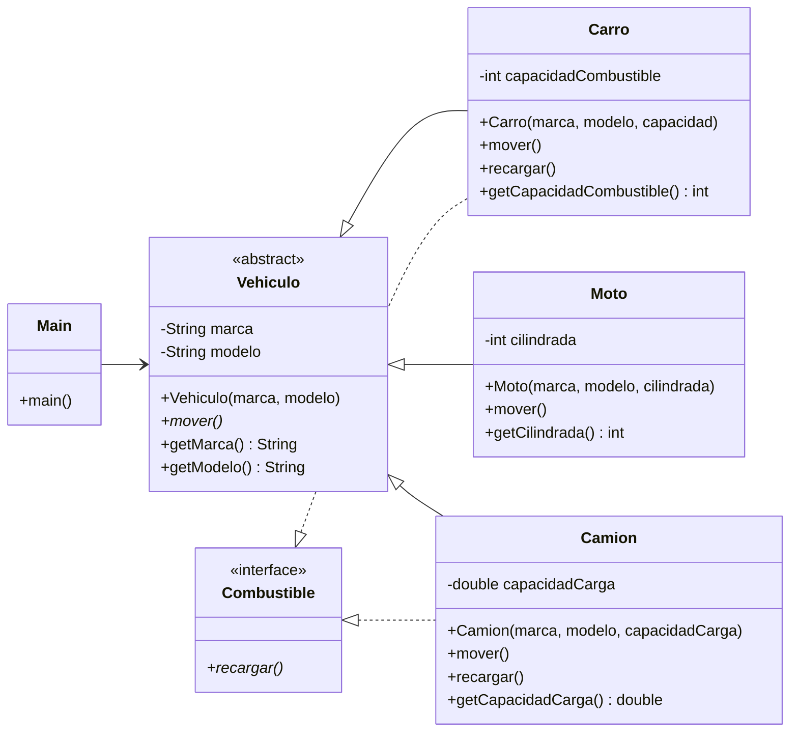

## Instrucciones:
- Crea una clase abstracta `Vehiculo` con atributos `marca` y `modelo`, y un método abstracto `mover()`.
- Implementa subclases como  `Carro`, `Moto` y `Camion`, cada una sobrescribiendo `mover()`.
- Crea una interfaz `Combustible` con un método `recargar()`. Haz que `Carro` y `Camion` la implementen.
- En el `main`, genera un arreglo de `Vehiculo` e invoca sus métodos polimórficamente.
- Entrega esperada: Repositorio con código documentado + un diagrama sencillo de la jerarquía de clases.

## Diagrama de jerarquía de clases

